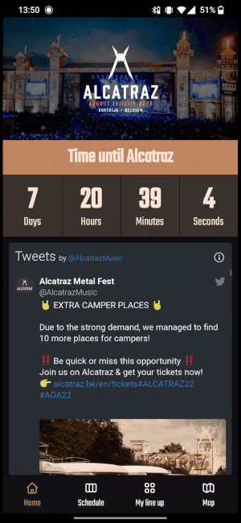

# Festival schedule PWA

Do you ever get frustated by having to carry a booklet around at a festival because there is no official app to view the schedule?
NO LONGER! Using this template you can create your own festival PWA by just filling in the [airtable template](https://airtable.com/shr8cic0WgWtPI3yo) and hosting the code on Vercel or some other free hosting service.

## Demo



## Configuring the project

### Fill in the airtable template

Use the airtable template to fill the PWA with your festival data.

https://airtable.com/shr8cic0WgWtPI3yo

### Add environment variables

```
REACT_APP_AIRTABLE_KEY=
REACT_APP_AIRTABLE_BEARER=
REACT_APP_SLOT_SIZE=
```

REACT_APP_SLOT_SIZE is used for the visual accuracy of the timetable  
(X = accurate up to X minutes)

### Install dependencies

```bash
$ yarn install
```

### Configure the webmanifest

You can change the contents of the `public/manifest.json` file to change the name, icons and default theme colors of your app.

## Run the development server

```bash
$ yarn dev
```
